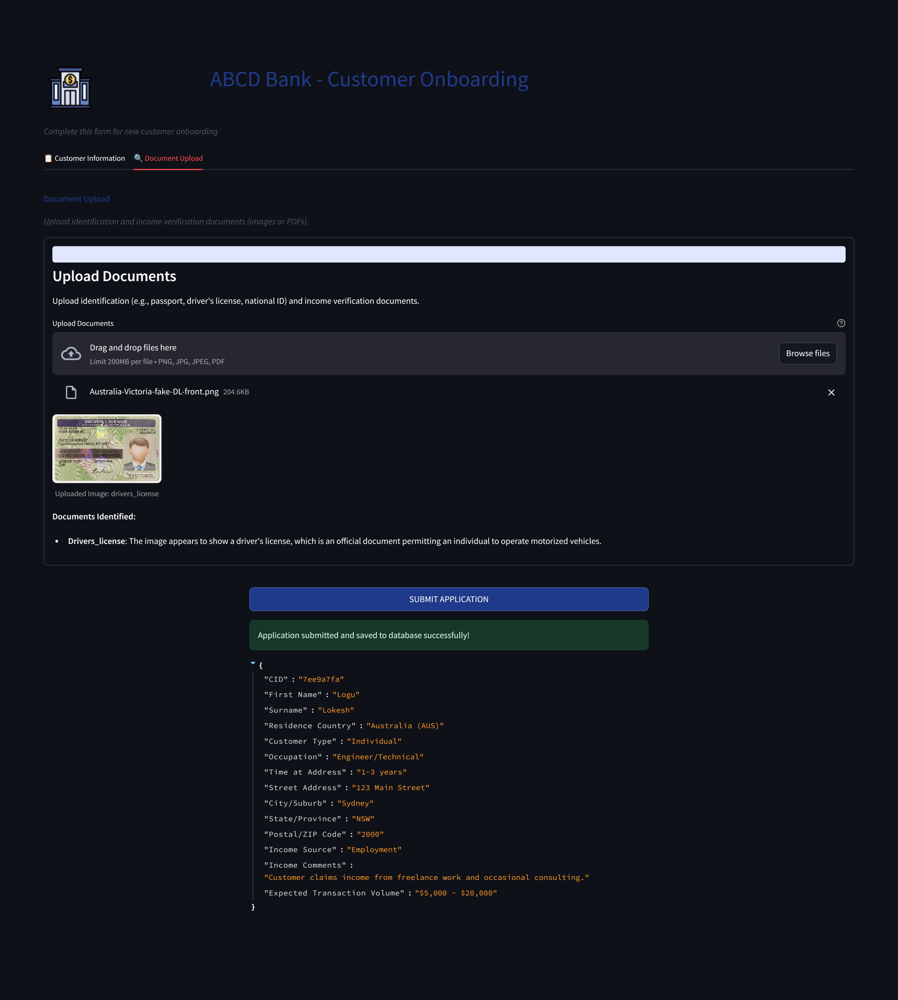
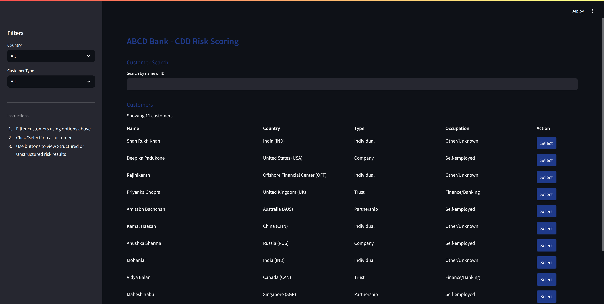
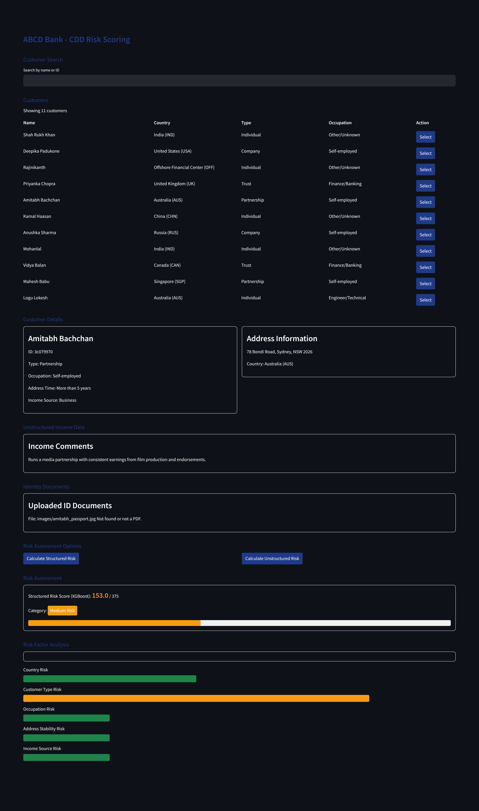
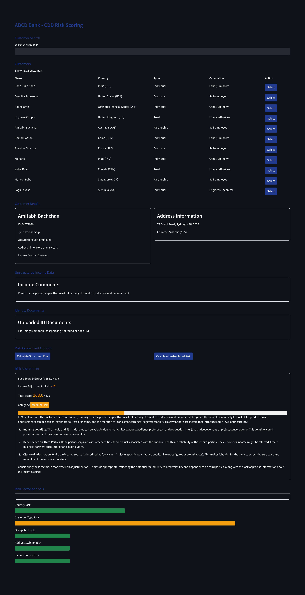

# 🛡️ FinCrime CDD Intelligence - Enterprise LLM-Enhanced Customer Due Diligence Suite

<div align="center">

[](https://python.org)
[](https://streamlit.io)
[](https://xgboost.readthedocs.io)
[](https://aws.amazon.com)
[](https://cloud.google.com)
[](https://azure.microsoft.com)
[](https://docker.com)
[](https://kubernetes.io)

*Enterprise-grade financial crime prevention platform with AI-powered customer due diligence and risk assessment*

</div>

---

## 🎯 Overview

**FinCrime CDD Intelligence** is an enterprise-grade financial crime prevention platform that combines advanced AI/ML technologies with regulatory compliance frameworks. Built for financial institutions, this solution provides intelligent customer onboarding, automated document validation, and sophisticated risk assessment using Large Language Models (LLMs). The application consists of two main components:

### 🚀 Core Components

<div align="center">

| Component | File | Description |
|-----------|------|-------------|
| 🧑‍💼 **Customer Onboarding** | `onboard.py` | Form-based customer data collection with AI document validation |
| 📊 **CDD Risk Scoring** | `cdd.py` | Advanced risk assessment using XGBoost + LLM enhancement |

</div>

---

## ✨ Key Features

<table align="center">
<tr>
<td width="50%">

### 🧑‍💼 Customer Onboarding
- ✅ **Personal Information Collection**
- 📍 **Address Management**
- 💰 **Income Source Tracking**
- 📤 **Multi-format Document Upload**
- 🤖 **AI-Powered Document Validation**
- 💾 **Secure Database Storage**
- 🎨 **Professional UI Design**

</td>
<td width="50%">

### 📈 CDD Risk Scoring
- 🔍 **Advanced Customer Filtering**
- ⚖️ **Dual Risk Assessment**
- 🧠 **LLM Risk Enhancement**
- 📊 **Interactive Visualizations**
- 📉 **Risk Factor Analysis**
- 📜 **Document Text Extraction**
- 🎯 **Real-time Risk Categorization**

</td>
</tr>
</table>

---

## 🧠 AI LLM Integration

### 👁️ Document Validation (`llava:7b`)
<details>
<summary><b>🔍 Click to expand document validation details</b></summary>

- **🎯 Purpose**: Automated document type identification and validation
- **📋 Supported Documents**: 
  - 🛂 Passport
  - 🪪 Driver's License
  - 🆔 National ID
  - 💸 Income Verification
- **⚡ Process**:
  1. Image/PDF upload and processing
  2. LLM analysis and classification
  3. Metadata generation and storage
- **✅ Benefits**:
  - 🚀 Reduces manual classification effort
  - 🎯 Enhances accuracy with AI recognition
  - 📋 Creates comprehensive audit trails

</details>

### 🧮 Risk Assessment (`granite3.2:latest`)
<details>
<summary><b>🔍 Click to expand risk assessment details</b></summary>

- **🎯 Purpose**: Unstructured text analysis for risk enhancement
- **📊 Scoring**: 0-50 point risk adjustment
- **🔍 Analysis Areas**:
  - 📈 Income stability assessment
  - ✅ Source legitimacy verification
  - 📝 Comment clarity evaluation
- **📤 Output Format**:
  ```
  Risk Adjustment: 20
  Explanation: Freelance work introduces income variability...
  ```

</details>

---

## ⚖️ Risk Scoring Architecture

### 🔢 Structured Risk (XGBoost Model)

<div align="center">

| Input Factor | Weight Range | Risk Impact |
|--------------|--------------|-------------|
| 🌍 **Residence Country** | 10-25 pts | High-risk regions score higher |
| 🏢 **Customer Type** | 5-20 pts | Trusts/partnerships > individuals |
| 💼 **Occupation** | 5-15 pts | Government/political roles flagged |
| 🏠 **Address Stability** | 5-20 pts | <1 year residence increases risk |
| 💸 **Income Source** | 5-20 pts | Inheritance/gifts score higher |

</div>

### 🧠 Unstructured Risk (LLM Enhancement)

```mermaid
graph LR
    A[💬 Income Comments] --> B[🤖 LLM Analysis]
    B --> C[📊 Risk Score 0-50]
    B --> D[📝 Explanation]
    C --> E[➕ Added to Base Score]
    D --> F[📋 Audit Trail]
```

### 🎯 Final Risk Categories

<div align="center">

| Category | Score Range | Color | Action |
|----------|-------------|-------|---------|
| 🟢 **Low Risk** | 0-99 | Green | Standard processing |
| 🟡 **Medium Risk** | 100-249 | Orange | Enhanced monitoring |
| 🔴 **High Risk** | 250-425 | Red | Manual review required |

</div>

---

## 🏗️ System Architecture

```mermaid
graph TD
    A[🎨 User Interface<br/>Streamlit] -->|Onboarding Input| B[📝 Customer Onboarding<br/>onboard.py]
    A -->|Risk Scoring Request| C[⚖️ CDD Risk Scoring<br/>cdd.py]

    %% Customer Onboarding Flow
    B -->|Collects Data| D[📇 Customer Data]
    B -->|Uploads Documents| E[📄 Document Files]
    B -->|Calls API| F[👁️ Ollama LLM<br/>llava:7b]
    F -->|Document Type & Description| B
    B -->|Saves Data| G[💾 SQLite Database<br/>bank_onboarding.db]
    B -->|Saves Files| H[📂 Images Directory]

    %% CDD Risk Scoring Flow
    C -->|Queries Data| G
    C -->|Structured Risk| I[⚙️ XGBoost Model]
    C -->|Unstructured Risk| J[🧠 Ollama LLM<br/>granite3.2:latest]
    J -->|Risk Adjustment & Explanation| C
    C -->|Displays Results| A

    %% Data Storage
    G -->|Customer Records| C
    H -->|Document Files| C

    %% External Dependencies
    F -->|Localhost:11434| K[🖥️ Ollama Server]
    J -->|Localhost:11434| K
```

---

## 🛠️ Prerequisites

### 📋 System Requirements

<div align="center">

<table>
<tr>
<td width="50%">

#### 🐍 **Python Environment**
- Python 3.8+ required
- Virtual environment recommended

#### 🤖 **AI Infrastructure**
- Ollama server running locally
- GPU recommended for optimal performance

</td>
<td width="50%">

#### 📦 **Required Models**
- `llava:7b` (document validation)
- `granite3.2:latest` (risk assessment)

#### 💾 **Storage**
- SQLite (included with Python)
- Local file system for documents

</td>
</tr>
</table>

</div>

---

## 🚀 Quick Start

### 1️⃣ **Installation**

```bash
# Clone the repository
git clone https://github.com/YourOrg/FinCrime-CDD-Intelligence.git
cd FinCrime-CDD-Intelligence

# Install dependencies
pip install -r requirements.txt
```

### 2️⃣ **Setup Ollama**

```bash
# Install Ollama (visit ollama.ai for instructions)

# Pull required models
ollama pull llava:7b
ollama pull granite3.2:latest

# Start Ollama server
ollama serve
```

### 3️⃣ **Prepare Environment**

```bash
# Create images directory
mkdir images

# Optional: Add logo.png for branding
```

### 4️⃣ **Launch Applications**

<div align="center">

<table>
<tr>
<td width="50%">

#### 🧑‍💼 **Customer Onboarding**
```bash
streamlit run onboard.py
```
Access at: `http://localhost:8501`

</td>
<td width="50%">

#### 📊 **CDD Risk Scoring**
```bash
streamlit run cdd.py
```
Access at: `http://localhost:8501`

</td>
</tr>
</table>

</div>

---

## 📦 Dependencies

<div align="center">

| Package | Purpose | Version |
|---------|---------|---------|
| 🎨 `streamlit` | Web UI framework | Latest |
| 📋 `pdfplumber` | PDF text extraction | Latest |
| 🖼️ `pillow` | Image processing | Latest |
| 📊 `pandas` | Data manipulation | Latest |
| 🔢 `numpy` | Numerical computing | Latest |
| 🤖 `scikit-learn` | ML preprocessing | Latest |
| 🚀 `xgboost` | Gradient boosting | Latest |
| 🌐 `requests` | HTTP client | Latest |

</div>

---

## 💾 Database Schema

### 📋 **Customer Table Structure**

<details>
<summary><b>🔍 Click to view full schema</b></summary>

<div align="center">

| Field | Type | Description |
|-------|------|-------------|
| `cid` | TEXT | Customer ID (MD5 hash) |
| `first_name` | TEXT | Customer first name |
| `surname` | TEXT | Customer surname |
| `residence_country` | TEXT | Country of residence |
| `customer_type` | TEXT | Individual/Company/Trust/Partnership |
| `occupation` | TEXT | Customer occupation |
| `time_at_address` | TEXT | Duration at current address |
| `street_address` | TEXT | Street address |
| `city` | TEXT | City |
| `state` | TEXT | State/Province |
| `postal_code` | TEXT | Postal/ZIP code |
| `income_source` | TEXT | Primary income source |
| `income_comments` | TEXT | Additional income details |
| `expected_transaction_volume` | TEXT | Expected transaction volume |
| `file_paths` | TEXT | Uploaded document paths |
| `descriptions` | TEXT | LLM-generated descriptions |
| `created_at` | TIMESTAMP | Record creation time |

</div>

</details>

---

## 📸 Application Screenshots

### 🧑‍💼 Customer Onboarding Flow

<div align="center">

#### Step 1: Personal Information


#### Step 2: Document Upload


#### Step 3: Validation Results


</div>

---

### 📊 CDD Risk Scoring Dashboard

<div align="center">

#### Step 1: Customer Selection


#### Step 2: Risk Analysis


#### Step 3: Results Visualization


</div>

---

## ⚙️ Configuration

### 🔧 **Environment Variables**

<div align="center">

| Variable | Default | Description |
|----------|---------|-------------|
| `OLLAMA_API_URL` | `http://localhost:11434` | Ollama server endpoint |
| `DATABASE_PATH` | `bank_onboarding.db` | SQLite database file |
| `IMAGES_DIR` | `images/` | Document storage directory |

</div>

### 🛡️ **Security Considerations**

<div align="center">

| ⚠️ **Development Features** | 🔒 **Production Recommendations** |
|----------------------------|----------------------------------|
| MD5 hashing for Customer ID | Use cryptographically secure hashing |
| Local file storage | Implement cloud storage with encryption |
| Basic error handling | Comprehensive error handling & logging |
| SQLite database | PostgreSQL or similar enterprise database |

</div>

---

## 🏢 Enterprise Deployment Strategies

### ☁️ **Multi-Cloud Architecture Overview**

<div align="center">

```mermaid
graph TB
    subgraph "🌐 Load Balancer Layer"
        LB[Global Load Balancer]
    end
    
    subgraph "🔒 Security & Gateway"
        WAF[Web Application Firewall]
        API[API Gateway]
    end
    
    subgraph "☁️ Multi-Cloud Deployment"
        subgraph "🟡 AWS"
            AWS_EKS[EKS Cluster]
            AWS_RDS[RDS PostgreSQL]
            AWS_S3[S3 Document Storage]
            AWS_LLM[Bedrock LLM Services]
        end
        
        subgraph "🔵 Azure"
            AZ_AKS[AKS Cluster]
            AZ_DB[Azure Database]
            AZ_BLOB[Blob Storage]
            AZ_AI[Azure OpenAI]
        end
        
        subgraph "🟢 GCP"
            GCP_GKE[GKE Cluster]
            GCP_SQL[Cloud SQL]
            GCP_STORE[Cloud Storage]
            GCP_AI[Vertex AI]
        end
    end
    
    LB --> WAF
    WAF --> API
    API --> AWS_EKS
    API --> AZ_AKS
    API --> GCP_GKE
```

</div>

---

### 🟡 **AWS Enterprise Deployment**

<details>
<summary><b>🔍 Click to expand AWS deployment strategy</b></summary>

#### 🏗️ **Architecture Components**

<div align="center">

| Service | Purpose | Configuration |
|---------|---------|---------------|
| 🚀 **Amazon EKS** | Container orchestration | Multi-AZ deployment with auto-scaling |
| 🗄️ **Amazon RDS** | Primary database | PostgreSQL with Multi-AZ, encryption at rest |
| 📦 **Amazon S3** | Document storage | Server-side encryption, versioning enabled |
| 🤖 **Amazon Bedrock** | LLM services | Claude, Llama models with guardrails |
| 🔐 **AWS IAM** | Access management | Role-based access with least privilege |
| 📊 **CloudWatch** | Monitoring & logging | Real-time metrics and alerting |
| 🌐 **Application Load Balancer** | Traffic distribution | SSL termination, health checks |
| 🛡️ **AWS WAF** | Web application firewall | DDoS protection, rate limiting |

</div>

</details>

---

### 🔵 **Azure Enterprise Deployment**

<details>
<summary><b>🔍 Click to expand Azure deployment strategy</b></summary>

#### 🏗️ **Architecture Components**

<div align="center">

| Service | Purpose | Configuration |
|---------|---------|---------------|
| ⚓ **Azure Kubernetes Service** | Container platform | Zone-redundant with RBAC |
| 🗄️ **Azure Database for PostgreSQL** | Managed database | Flexible server with HA |
| 📦 **Azure Blob Storage** | Document repository | Hot/Cool tiers with encryption |
| 🤖 **Azure OpenAI** | LLM services | GPT-4, embeddings with content filtering |
| 🔐 **Azure Active Directory** | Identity management | Conditional access policies |
| 📈 **Azure Monitor** | Observability | Application insights, log analytics |
| 🌐 **Azure Front Door** | Global load balancer | CDN with WAF protection |
| 🔒 **Azure Key Vault** | Secrets management | HSM-backed key storage |

</div>


</details>

---

### 🟢 **Google Cloud Platform Deployment**

<details>
<summary><b>🔍 Click to expand GCP deployment strategy</b></summary>

#### 🏗️ **Architecture Components**

<div align="center">

| Service | Purpose | Configuration |
|---------|---------|---------------|
| ⚓ **Google Kubernetes Engine** | Container orchestration | Autopilot mode with Workload Identity |
| 🗄️ **Cloud SQL** | Managed PostgreSQL | High availability with automated backups |
| 📦 **Cloud Storage** | Object storage | Multi-regional with lifecycle policies |
| 🤖 **Vertex AI** | ML platform | Custom models with monitoring |
| 🔐 **Cloud IAM** | Access control | Fine-grained permissions |
| 📊 **Cloud Monitoring** | Observability | SLI/SLO monitoring |
| 🌐 **Cloud Load Balancing** | Traffic management | Global HTTP(S) load balancer |
| 🛡️ **Cloud Armor** | DDoS protection | Adaptive protection policies |

</div>


#### 🎯 **AI/ML Integration**

- 🤖 **Vertex AI Pipelines**: MLOps automation
- 📊 **BigQuery ML**: Large-scale analytics
- 🔍 **Document AI**: Automated document processing
- 🛡️ **AI Platform**: Model serving and monitoring

</details>

---

### 🔄 **Multi-Cloud Orchestration**

<details>
<summary><b>🔍 Click to expand multi-cloud strategy</b></summary>

#### 🌐 **Cross-Cloud Architecture**

```yaml
# multi-cloud-config.yaml
apiVersion: v1
kind: ConfigMap
metadata:
  name: multi-cloud-config
data:
  primary-cloud: "aws"
  disaster-recovery: "azure"
  analytics-cloud: "gcp"
  data-replication: "enabled"
  failover-threshold: "99.9%"
```

#### 🔧 **Orchestration Tools**

<div align="center">

| Tool | Purpose | Configuration |
|------|---------|---------------|
| 🚀 **Terraform** | Infrastructure as Code | Multi-cloud provisioning |
| ⚓ **Kubernetes** | Container orchestration | Federated clusters |
| 🔄 **ArgoCD** | GitOps deployment | Multi-cluster sync |
| 📊 **Prometheus** | Cross-cloud monitoring | Federated metrics |
| 🗄️ **Velero** | Backup orchestration | Cross-cloud recovery |

</div>

#### 🎯 **Benefits**

- 📈 **99.99% Availability**: Multi-cloud redundancy
- 💰 **Cost Optimization**: Best pricing across clouds
- 🌍 **Global Reach**: Optimal latency worldwide
- 🛡️ **Vendor Independence**: Reduced lock-in risk

</details>

---

### 📊 **Enterprise Monitoring & Observability**

#### 📈 **Monitoring Stack**

```yaml
# monitoring/prometheus-config.yaml
global:
  scrape_interval: 15s
  evaluation_interval: 15s

scrape_configs:
  - job_name: 'fincrime-cdd-intelligence'
    static_configs:
      - targets: ['fincrime-cdd-service:8501']
    metrics_path: /metrics
    scrape_interval: 10s

  - job_name: 'kubernetes-pods'
    kubernetes_sd_configs:
      - role: pod
    relabel_configs:
      - source_labels: [__meta_kubernetes_pod_annotation_prometheus_io_scrape]
        action: keep
        regex: true
```

#### 🚨 **Alerting Rules**

```yaml
# alerting/rules.yaml
groups:
  - name: fincrime-cdd.rules
    rules:
      - alert: HighErrorRate
        expr: rate(http_requests_total{status=~"5.."}[5m]) > 0.1
        for: 5m
        labels:
          severity: critical
        annotations:
          summary: "High error rate detected"
          description: "Error rate is {{ $value }} errors per second"

      - alert: DatabaseConnectionFailed
        expr: up{job="postgresql"} == 0
        for: 2m
        labels:
          severity: critical
        annotations:
          summary: "Database connection failed"
```

---

### 🔒 **Enterprise Security Implementation**

#### 🛡️ **Security Checklist**

<div align="center">

- [x] **🔐 Encryption at Rest**: All data encrypted using AES-256
- [x] **🌐 Encryption in Transit**: TLS 1.3 for all communications
- [x] **🎭 Identity Management**: OAuth 2.0 / SAML integration
- [x] **📊 Audit Logging**: Comprehensive security event logging
- [x] **🚪 Network Segmentation**: Micro-segmentation with service mesh
- [x] **🔍 Vulnerability Scanning**: Automated security assessments
- [x] **📋 Compliance**: SOC 2, PCI DSS, GDPR ready
- [x] **🛡️ DDoS Protection**: Multi-layer protection mechanisms

</div>
